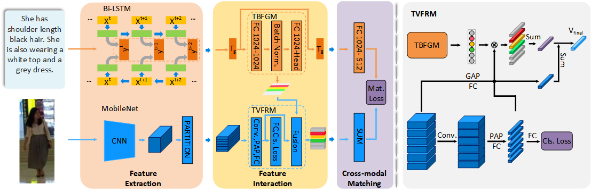

# TVFR for text-based person search

TensorFlow implementation of [Text-guided Visual Feature Refinement for Text-Based Person Search](https://dl.acm.org/doi/pdf/10.1145/3460426.3463652) accepted by ICMR 2021.
The code is implemented based on the TensorFlow implementation of [Deep Cross-Modal Projection Learning for Image-Text Matching](https://github.com/YingZhangDUT/Cross-Modal-Projection-Learning)

## Introduction
We propose a Text-guided visual feature refinement framework for text-based person search, which has two sub-networks, namely, Text-Based Filter Generation Module (TBFGM) and Text-Guided Visual Feature Refinement Module (TVFRM).



## Requirements

1. TensorFlow 1.5.0
2. CUDA 9.0 and cuDNN 7.6
3. Python 2.7

## Usage

### Data Preparation
1. Please download [CUHK-PEDES](https://github.com/ShuangLI59/Person-Search-with-Natural-Language-Description)

2. Convert the CUHK-PEDES image-text data into TFRecords.
```
cd builddata & sh scripts/format_and_convert_pedes.sh
```

### Model Preparation

1. Please download [Pretrained MobileNet_V1 Model](https://drive.google.com/file/d/1VhVjR5jmXPZZeMeyULMQLEeok0wtFY-R/view?usp=sharing) for reimplementation or [Best Result Model](https://drive.google.com/file/d/1Ofw5ia_M-JYZD4EbIEC13Mp95KCGR9O8/view?usp=sharing) in our paper for testing.
2. Please modify the `RESTORE_PATH`  in the training script to your path where the `Pretrained MobilNet_V1 Model` is saved.
3. Please modify the `Save_NAME` in the training script to your path where the `Best Result Model` is saved if you wanna to test using our best model.

### Training

1. Please Download Pretrained MobileNetV1 checkpoint

2. Train TVFR with MobileNet V1 + Bi-LSTM on CUHK-PEDES
```
sh scripts/train_pedes_mobilenet_cmpm_cmpc.sh
```

### Testing
1. Compute R@K(k=1,5,10) for text-to-image retrieval evaluation on CUHK-PEDES
```
sh scripts/test_pedes_mobilenet_cmpm_cmpc.sh
```

## Reference

Zhang, et al. Deep Cross-Modal Projection Learning for Image-Text Matching, ECCV 2018.

## Citation
If you find TVFR useful in your research, please kindly cite our paper:
```
@inproceedings{gao2021text,
  title={Text-Guided Visual Feature Refinement for Text-Based Person Search},
  author={Gao, Liying and Niu, Kai and Ma, Zehong and Jiao, Bingliang and Tan, Tonghao and Wang, Peng},
  booktitle={Proceedings of the 2021 International Conference on Multimedia Retrieval},
  pages={118--126},
  year={2021}
}
```

## Contact
If you have any questions, please feel free to contact gaoliying@mail.nwpu.edu.cn 
